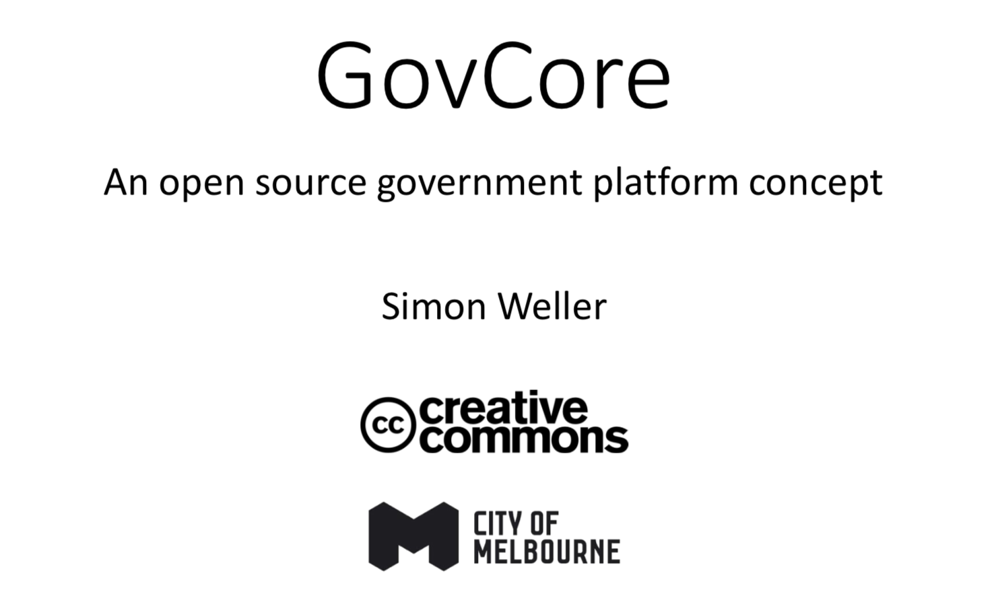

GovCore is an ambitious project which aims to develop an information management system which can be used to run council: by council, for council

The drive behind the platform is to address the problems in existing solutions currently available to government:

- Satisfying audit
- Supporting flexibility and continuous improvement
- Resilience and scale in deployment options
- Onboarding new functions and organisations (data migration)
- Managing attachments like images, documents and records
- Embedding spatial mapping
- Managing roles and responsibilities
- Adopting international and industry standards
- Satisfying records management obligations

Most, if not all, solutions offered to council are not tailored for the government sector; they are off the shelf offerings with a few tweaks to “meet” government requirements. Or they are bespoke builds with bespoke prices – out of reach for most local councils. GovCore is an open source platform, utilising the contributions of a network of developers, with the aim of being accessible to all.

Read the [GovCore Concept](docs/govcore.md) for a more detailed description.

## About the Project

This project is the first attempt to realise Simons' broader vision of GovCore.

It was a six-week experiment run at the City Of Melbourne by [CodeForAustralia](https://codeforaustralia.org/) fellows: Jonathan Castillo Bello and Victor Nava under the guidance and support of Simon Weller, Daniella Mazzone and Colin Fairweather.

The main goals of the project were to demonstrate that:

1. A system following the GovCore principles can be built
2. Such a system is a viable option for building apps for councils

To achieve that, we built these prototypes:

- [GovCore](govcore/): JSON Document/Template store accesible via HTTP API
- [GovAuth](govauth/): An authorization system for CoM clients to login into CoM services
- [GovBox](govbox/): Web client to manage/explore GovCore

A six week sprint is not long enough (obviously!) to be able to fully develop the GovCore vision, however in that time we have managed to demonstrate on a small scale, that it is achievable. The prototypes are a starting point for the GovCore platform to be continued to be developed. By starting out on this small scale, we have proven that the GovCore platform can be scaled up in line with the wider vision.

Some notes about the process and rationale of the implementations can be found in the [docs directory](docs/).

[TODO insert system diagram]

[TODO insert govauth and govbox screenshots]

## Features List

- [x] Basic Rest API
- [x] CRUD Documents: Entities, Graph, Events
- [x] Data validation with Template Documents
- [x] Store Events on data changes
- [ ] Data validation with remote schema/api
- [ ] Versioning
- [ ] Access Control
- [ ] Workflow Engine
- [ ] Generic Client
- [ ] Data importing tools

## Roadmap

    Research → Prototype → Real world build → Real world use
                  👆
              You are here

- [x] Basic Prototype: CRUD Docs, Graph, Logs, Templates, Validation
- [x] Prototype GovAuth (App that runs on GovCore)
- [x] Prototype GovCore client (App that runs on GovCore)
- [ ] Get funding 💰
- [ ] Prototype extended features (Versioning, Access Control, Workflows, Security)
- [ ] Go to production with small real world case
- [ ] Improve from experience
- [ ] Get more funding 💰
- [ ] Build a few more clients (Scale)
- [ ] Improve from experience
- [ ] Get more funding 💰
- [ ] Marketplace: Build services for other gov agencies
