# GovCore

An open source government platform concept by Simon Weller. The views and opinions in this article are those of the author and do not necessarily reflect the views or opinions of the City of Melbourne.

# Think Bigger

## Background

This story has its genesis in a question...what would be **really disruptive** to local government?

> Imagine if you could download everything you need to run a council - for free - from GitHub

Which begs the questions:

### Why even try?

- What is the pain we’re trying to solve?
- What is the prize if we do?

### What would the new ecosystem, look like?

- Where are the market opportunities?

### How would you build it?

- Technology components
- Architecture and data governance

And then beyond minimum viable product:

### Solving endemic challenges in public sector systems:

- Satisfying audit
- Supporting flexibility and continuous improvement
- Resilience and scale in deployment options
- Onboarding new functions and organisations (data migration)
- Managing attachments like images, documents and records
- Embedding spatial mapping
- Managing roles and responsibilities
- Adopting international and industry standards
- Satisfying records management obligations

## Frontend / Backend

This architecture vision is virtually silent on design and technology of the frontend. This should not be taken to mean that user experience is less important. Nothing could be further from the truth.

The frontend is far and away the most important component to our customers, our staff, our sponsors and key stakeholders.

This architecture vision imagines a backend that maximises the potential for creativity and ongoing innovation in user experience and service design, acknowledging that design paradigms continually change and new channels continue to emerge.

Traditional platforms are difficult to implement and difficult to change once implemented, leading to a punctuated equilibrium – occasional cataclysmic change with long periods of suspended animation during which the business is hindered from innovating.

The vision for GovCore is a backend that supports ongoing low-cost changes to data definitions and business processes. This positions the business to innovate the user experience as well as data needs, supporting processes, freeing service designers to continually experiment, iterate and transform end-to-end service delivery.

## Design Inflection

Current digital transformation approaches have reached the limits of speed and scale – a new approach is needed.

### Arts & Crafts

- Design and Manufacture co-located
- Artisan workshops
- One-off and small batch

### Modernity

- Design separate from manufacture
- Production lines
- Manufacture at speed and scale

We are at the point of transition between Arts & Crafts and Modernity – we need to retool and rethink our delivery models

        Arts & Crafts → Modernity
                      👆
                 You are here

# Why even try?

## The pain

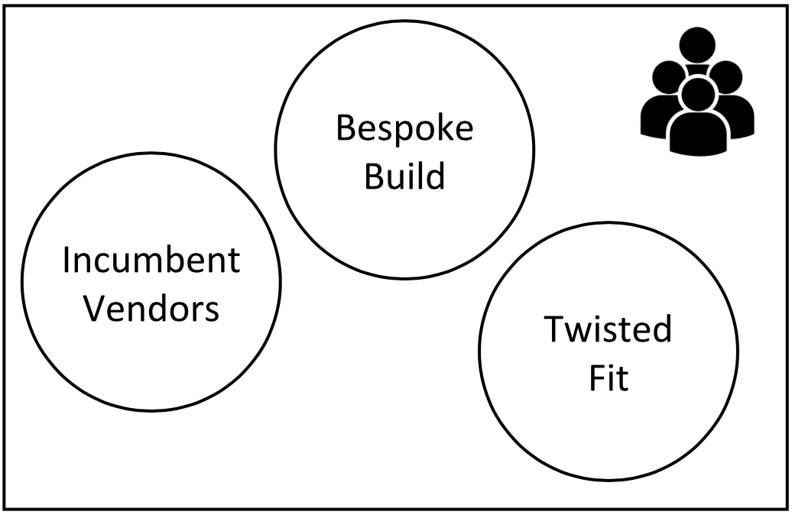

Our reality is three system options:

1. Incumbent vendors are tending to leverage existing platform investments rather than innovating
2. Bespoke built solutions are innovative but incur all the costs of establishing and running an internal development capability and risk of knowledge-loss and obsolescence
3. Old-school platform solutions (e.g. ERP or CRM) twisted to fit government’s needs with vast upfront and ongoing cost of customisation and generally sub-optimal outcomes

- The prison: There are no options outside this reality –  outside the box – so every agency is cyclically hopping from one option to another, generating massive duplication and redundancy across the sector
- Vast amounts of public resources spent migrating from one poor solution to another

## Existing options

### Incumbent Vendors

- Infor
- Civica
- Technology One

Problems:

- Foundations laid pre-2000
- Most have not re-architected*
- No APIs (or very limited)
- No mobile customer interface
- Not cloud native (or capable)
- No flexibility to design new user experiences and services

### Twisted fit

- Oracle
- SAP
- Salesforce

Problems:

- Designed for other industries
- “Configured” for government (customised, in reality)
- Older examples have similar constraints to incumbents

### Bespoke build

- Handbills & Fundraising
- PRISM (historic)
- SASSI (historic)

Problems:

- No economy of scale (each agency bares 100% of cost)
- Insource only option for ongoing maintenance and enhancements(?)
- Usually high ongoing dependency on individual developer
- Best-practice software development lifecycle unrealistic at small scale

## Outside the box

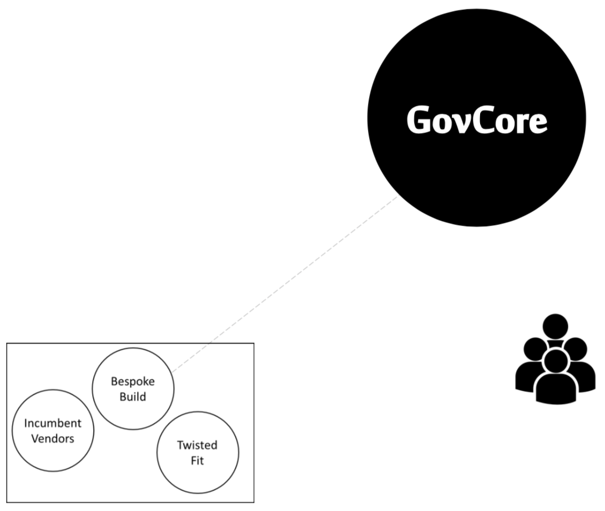

The vision of GovCore is an open source platform built on robust scalable big data technology, designed to maximise innovation in both customer experience, data management and business process automation.

It is a form of bespoke build, but one where a large community of developers can contribute openly - sharing ideas and improvements and maximising economy of scale in development talent.

## The prize

On the back of an envelope, lets say conservatively in Victoria:

A capital city spends $2million licensing LG mission systems + $2 million annual labour and support

The next 5 biggest councils spend about the same combined

The next 10 biggest suburban and regional councils combined spend about the same

The remaining 60+ suburban, regional and rural councils together spend about the same

The payoff: potentially AU$25million+ per annum just in Victorian local government...

It may be even bigger than this? How do we find out?

...other levels of government...Australia...Asia-Pac...Europe...the Americas...

## Widening gap

The longer we wait to adopt new approaches and platforms the wider the gap becomes

The rest of the world is accelerating its adoption of emerging technologies like cloud, voice, mobility, robotics, AI, ML, DL, IoT, process automation etc

Government continuous improvement

## Reusability

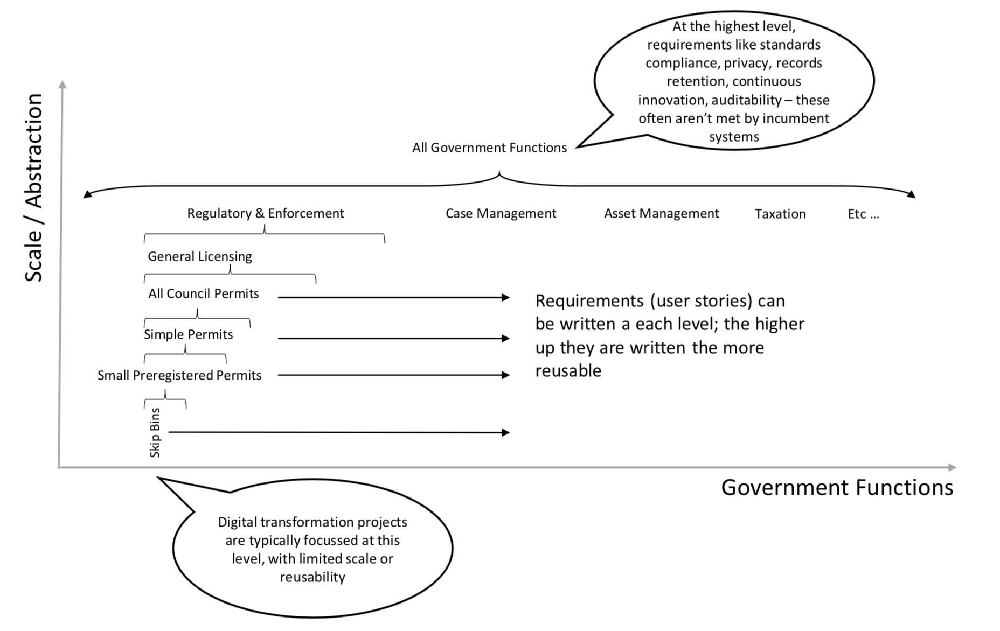

## A Common Target

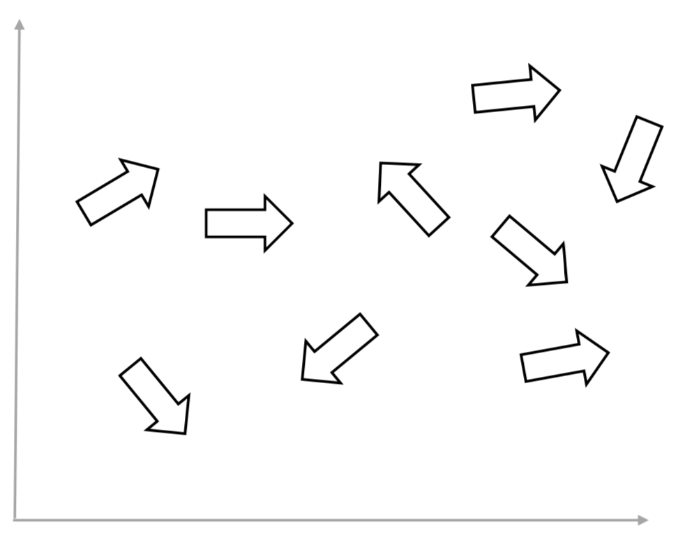

IT projects – including (and especially) digital transformations – tend to be independent and don’t work towards a common goal

This architecture vision provides a common target to aim for whilst still supporting agile principles of small iterative builds, minimum viable products and early tangible deliverables.

## An alternative reality

What would a truly disruptive, and radically different (and much better) reality look like?

1. Fully open source option
2. Coordinated global innovation ecosystem 
3. Big data at the core
4. Minimum code – massive reuse
5. On-boarding as easy as signing on to LinkedIn

## What I mean by Open Source

### Free

- Can run on an entirely free software platform
- Code is freely available online (Git)
- Costs reduced to hosting and DevOps & support staff

### Platform independent

- Entirely portable
- Runs on any platform

### License ensures software stays free

- GPL, MIT, Apache, Creative Commons or similar

## Is Open Source credible?

> The whole Internet (and Android) runs on open source

So yes...with the proviso that:

1. There is a large stable global community supporting and developing
2. There is preferably one or more commercial organisations offering hosting, training, support and development leadership
3. Most of the internet and large platforms like Android are open source

# Ecosystem

## Where is the commercial opportunity?

Open source examples exist where the software is freely available but commercial opportunities are exploited around:

- Hosting (Drupal is an Open Source Web content management system, Acquia is a hosting service)

- Distribution, Support and Training (Linux is an open source operating system, Red Hat is a hosting, support and assurance service)

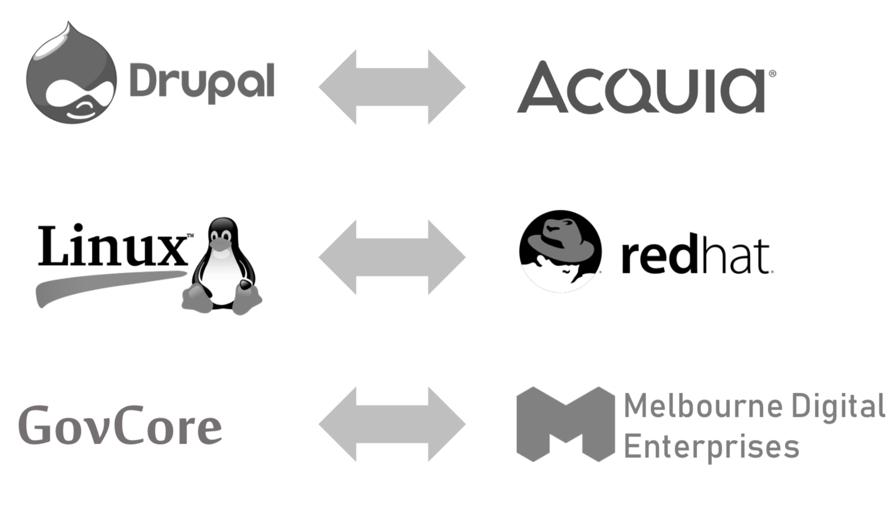

## Commercial ecosystem

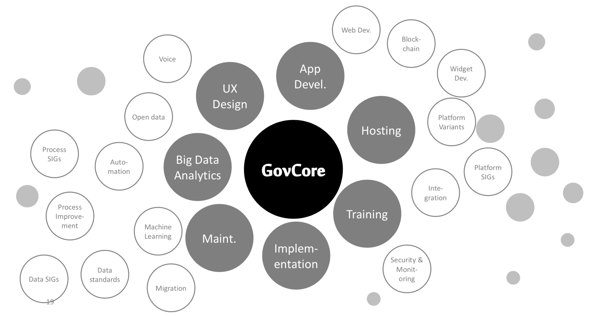

## GovCore Marketplace

> The goal is to create a two-sided marketplace for developers and users

There are 5-6 main elements to the marketplace:

- Application development
- Data
- Hosting
- Implementation and DevOps Services
- Process automation

A key consideration is management and orchestration of both the marketplace and the GovCore development effort.

## Platform independent

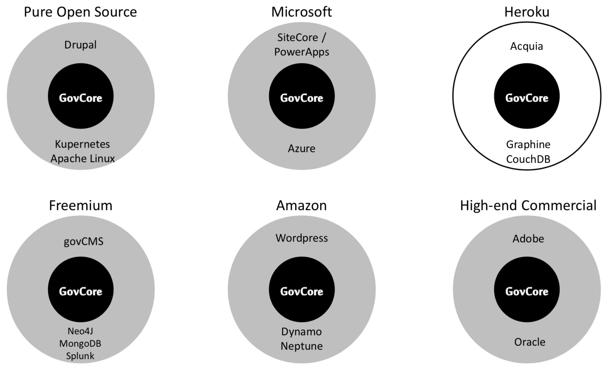

Portability is vital to future proof the platform, but also to support the diversity in size and skill-base of local councils (and other agencies)

## Salesforce Heroku

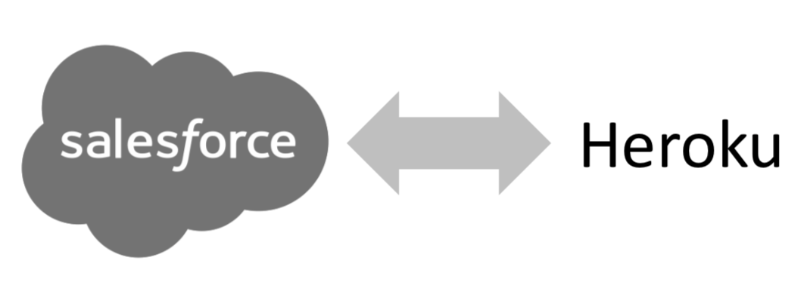

- provides a rapid prototyping sandbox
- is a genuine Open Source platform
- is owned by Salesforce
- runs on Amazon
- is subscription based, not user based
- has an unmetered out-of-the-box back door into Salesforce (e.g. Customer objects)

Heroku offers a sandbox platform to rapidly prove the key elements of the GovCore architecture, stay true to open source principles, engage developers in the latest languages and data frameworks and provide DevOps tools for fast configuration, management, resilience and scale.

# Architecture

## Built on big data

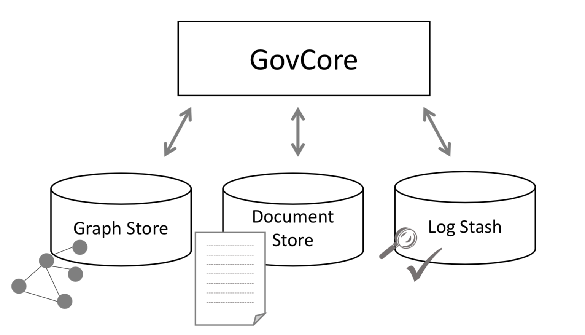

## Why three data stores?

### Document Store

The entities governments manage (the source of truth)

Unlimited flexibility

### Graph

The relationships between entities

Unlimited relationships

### Log Stash

Log every change to entities and relationships

Unlimited scale

> Unlimited mess? Architecture and data management practices are paramount. Design decisions become business-based, not technically constrained

## Combined it looks like this

Real-world entities and relationships reflected much more accurately, flexibly and naturally than relational databases can.

## What I mean by document (json)

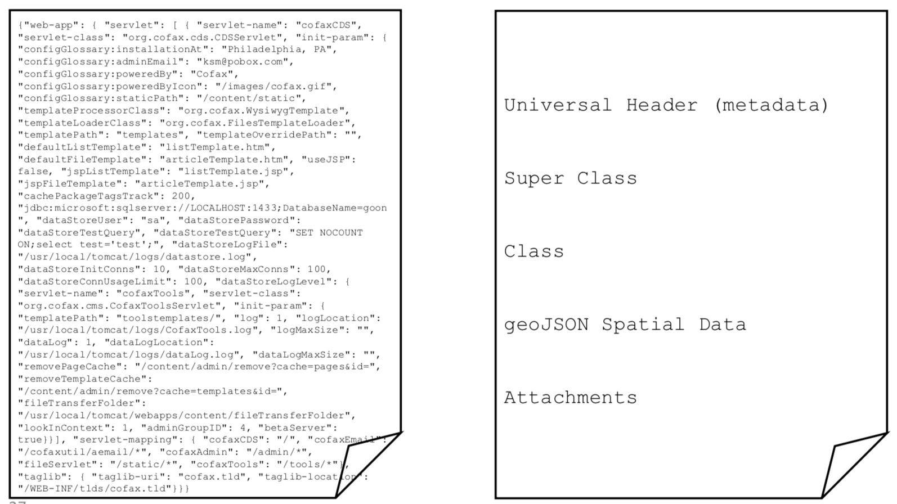

## Ensuring data quality

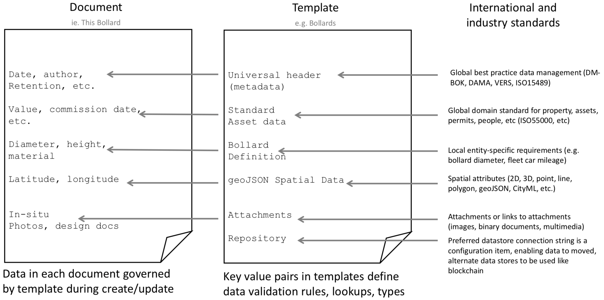

Data in each document governed 28 by template during create/update

Key value pairs in templates define data validation rules, lookups, types

## Minimum code 1 of 2

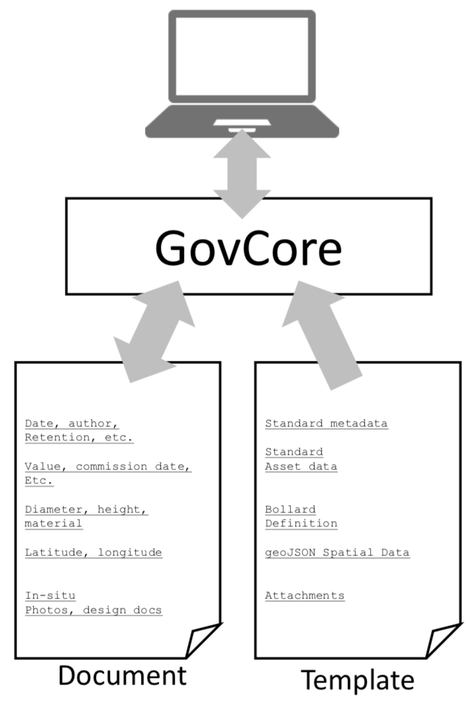

The ultimate in reductionism – the only entity (class/object) the code has to manage is a ‘document’.

> The primary function of GovCore is to combine JSON documents with the associated JSON template (with inherent data rules) and present them to a user

## Minimum code 2 of 2

Seek a function-rich platform to minimise functions in GovCore
(e.g. Drupal, jBPM, Apache ODE)

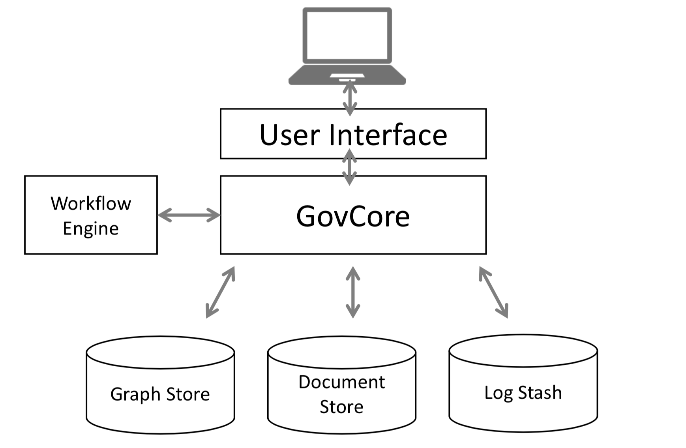

> Architecture principle: If there is a credible open source function already, use it. Don’t code if you don’t have to.

## Workflow

Envisaging government as an information processing ‘production line’, taking ‘raw’ information in (e.g. requests and applications), processing it and exporting ‘value-added’ information (e.g. permits, decisions, etc). All processes are born digital – no paper!

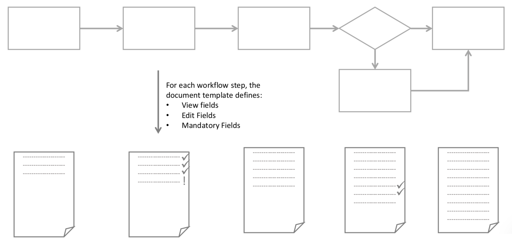

## Architecture

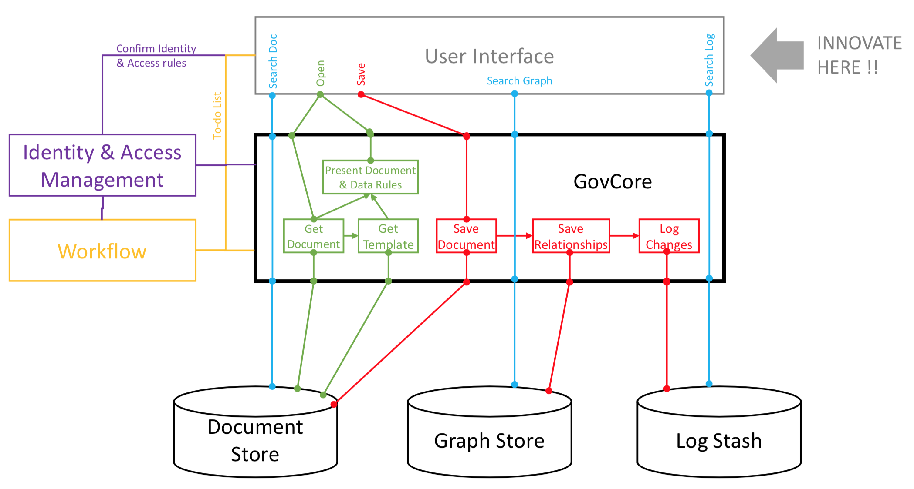

After that, innovation flourishes in template and workflow design and improvement as well as freeing UX designers and developers to explore and create new user experiences.

> Architecture principle: Everything is open and RESTful

## User experience

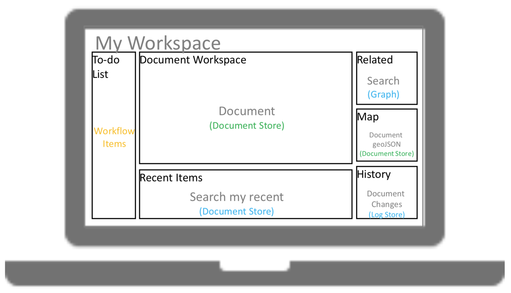

A basic user-configurable interface with flexible widgets is just one

A fertile ecosystem of user experiences to suit different agencies’ needs and aspirations built around a common core.

## Agile Build approach

Build approach will be a typical use-case by use-case incremental build. At some point the core will be complete and become relatively static.  However, innovation around user experience, workflow, data analytics will continue to snow-ball.

# Beyond MVP

## Log Stash

Logs in traditional relational systems are huge, unintelligible, drag on the performance of the system and often fall short of ever-increasing auditor expectations. A big data log stash logs orders of magnitude more data and provides searchability and advanced analytics.

By logging every single time a document or graph-relationship changes, every conceivable audit request can be addressed.
Combined with universal version control on documents, a complete record of government activity is created, assuring the community of unprecedented accountability and opportunity for appropriate transparency.

These are deliberately the lowest common denominator metrics that apply to every public sector service or activity. Agencies are highly creative in coming up with a wild variety of metrics. Here we start with:

- Number of customers
- Cost of interaction
- Carbon footprint
- Number of interactions
- Revenue of interaction
- Customer Satisfaction (e.g. NPS)

These six universal metrics provide the foundation for standardised performance analysis across all government activities.

## Version Control

To bake rapid continuous improvement in from the start, we have to assume everything will always change...

Options are needed to define what happens when templates are changed: i) keep documents on old version, ii) update documents as they’re re-saved or iii) retrospectively apply change in bulk.

Version control is required for workflow, to enable in-flight work-flow updates; ‘open’ documents continue with the old workflow, new documents follow the new workflow.

Despite using big data platforms with theoretically ‘unlimited’ scale, there is a cost implication – hence records retention and archiving policy remains relevant.

> Architecture principle: everything is versioned

## Lakes and puddles – deployment options

A single monolithic implementation is feasible with a single large document datastore across multiple domains.
A downside of this is a single point for failure and a data honeypot.

Smaller separate implementations for different purposes may reduce risk but increase maintenance overheads and potentially data integration challenges.

##  Blockchain

Because GovCore is green-fields, blockchain support can be baked in from the start providing options for an immutable ledger...

> Architecture principle: blockchain is compute-intensive so use it wisely

Candidates could include:

- Self-managed identity
- Public Registers
- Public marketplace permits
- High-risk audit items
- Entitlements, rights, trades

## Long-term aspiration: Onboarding Wizard

1. Sign-up to GovCore → Infrastructure-as-code instance created
2. Upload Customers → Machine-learning data import engine
3. Upload Properties → Machine-learning data import engine
4. Upload Assets → Machine-learning data import engine
5. Open for Business → Industry-standard workflows

## Auto-configuration

Instead of a massive data cleaning effort to prepare data for import into a new system with a rigid data model, we import the data largely* as-as, use basic machine learning to determine the nature of the data and auto-generate a template (with data rules). The business is no worse-off in terms of data quality, and is now in a system that supports rapid continuous improvement of both data and process.

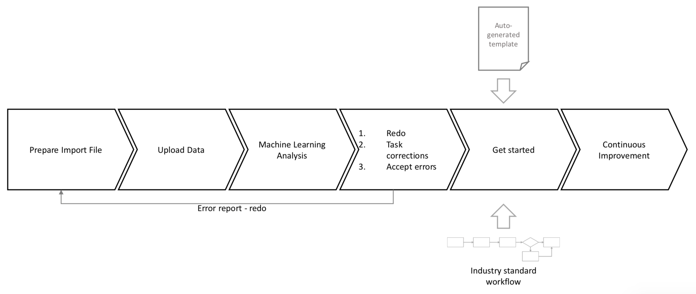

Applying template headers and domain superclass fields (and as much data cleansing as possible) will yield better results, obviously – but not mandatory because document store can hold ‘bad’ data until its touched by a user and template rules enforce correction on save. Templates can then be progressively improved and standardised.

## Document Editing and Linking

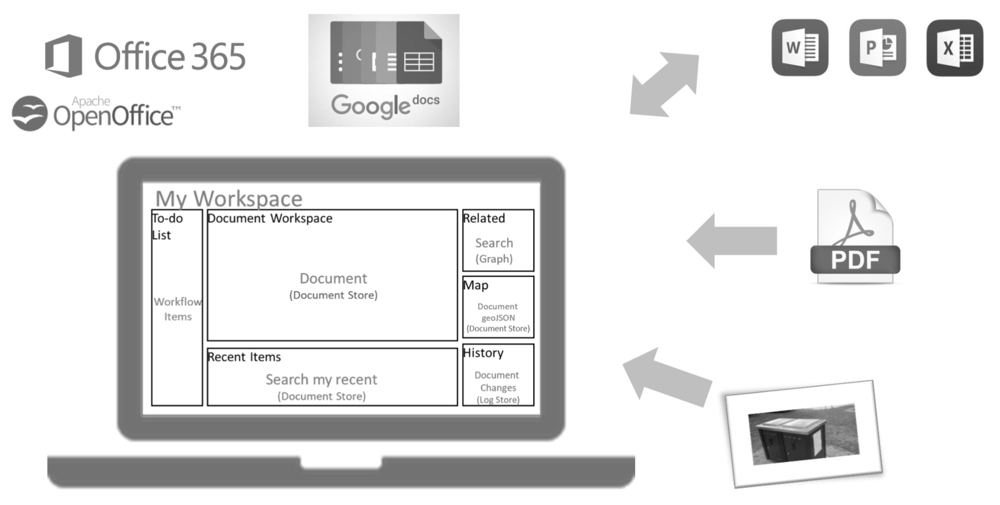

Platform should support Office365 and Google – ensuring portability and platform independence at every layer.

> Architecture principle: store (binary) attachments in the system that manages them

## Spatial Data Maintenance

Traditional architectures separate the spatial attributes of an object (in a specialist spatial system) from the aspatial attributes (in a typical line-of-business system) making data maintenance vastly onerous, duplicative and error-prone.

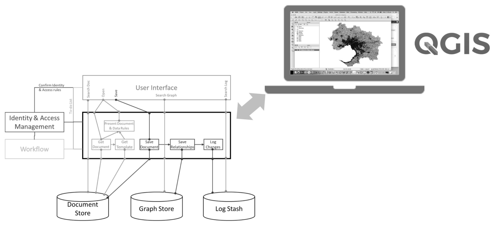

The solution needs to solve the challenge of individual and bulk maintenance of spatial data – combining spatial and aspatial attributes in a common document structure is a huge step forward.

## Position

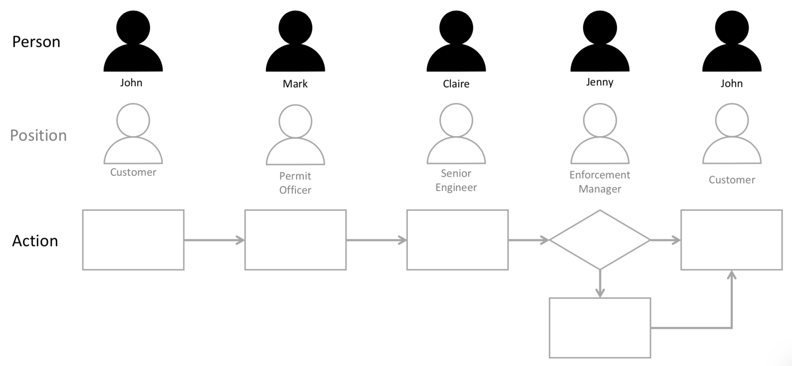

Position Description: an interesting artefact is that you could extract the responsibilities of a Position from the actions assigned to it ...

> Architecture Principle: workflow actions must be assigned to positions not people (in turn, people are assigned to positions)

## Records and Standards Compliance

Global standards can often be theoretical and unachievable and entirely dependent on the capability of vendors, the capacity of agencies and the will of legislators. Similarly, after 60 years of computing, the gap between records management best practice and actual data management practice seems insurmountable.

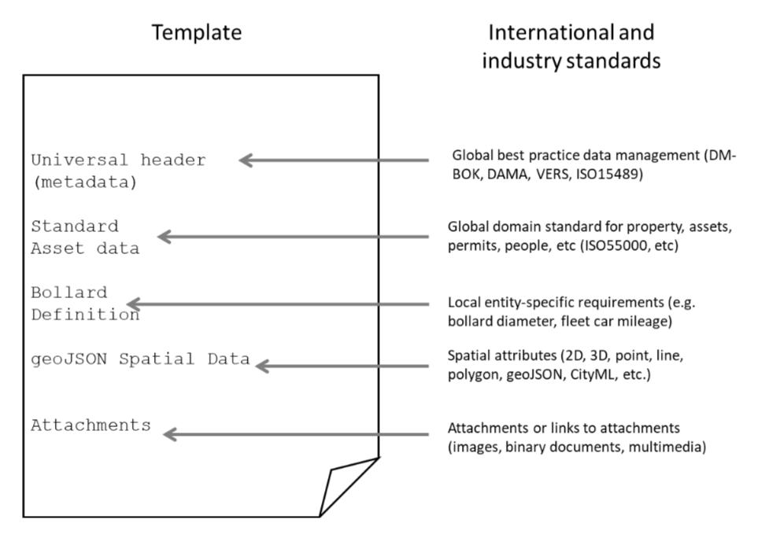

In this model international standards for data management and domain best-practice are instantiated in the document templates (as well as workflows).

Moreover, changes recommended by global and regional standards bodies can be directly incorporated into new template versions.

In this way, the gap between aspirations for both business and data best practice and reality can be closed.
